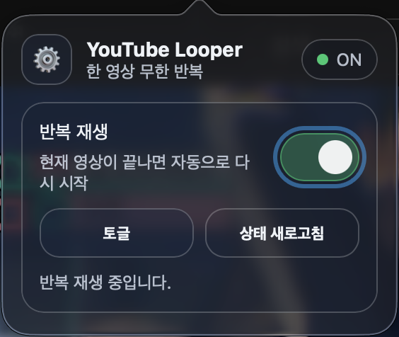
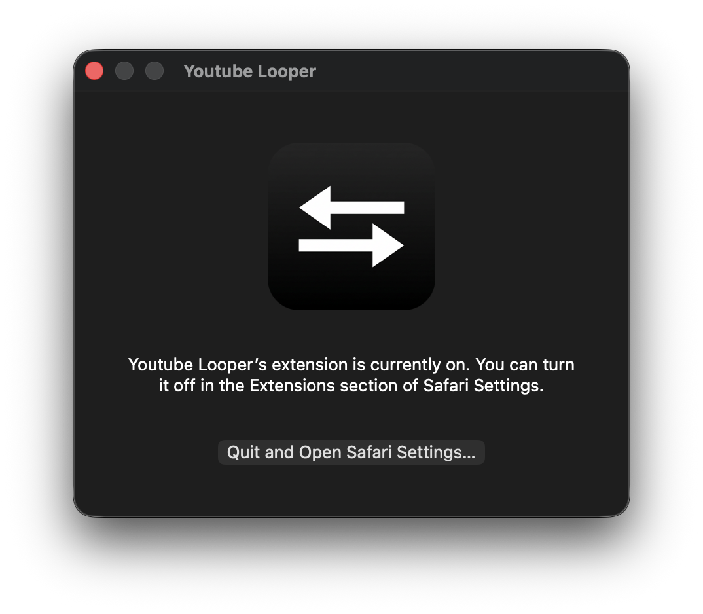

# YouTube Looper (Release-only)

[한국어](./README.md) | [English](./README.en.md) | [日本語](./README.ja.md)

This repository is used for **release artifacts only**.
Source code is maintained in a separate private repository.

## Download
- Latest builds: [Releases](https://github.com/adgk2349/Youtube_Looper/releases)

## Screenshots

## Documentation Languages
- [Korean (main)](./README.md)
- [English](./README.en.md)
- [Japanese](./README.ja.md)

## Note
- No application source code is included in this repository.
