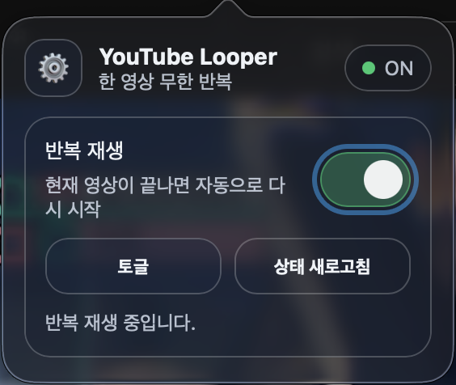
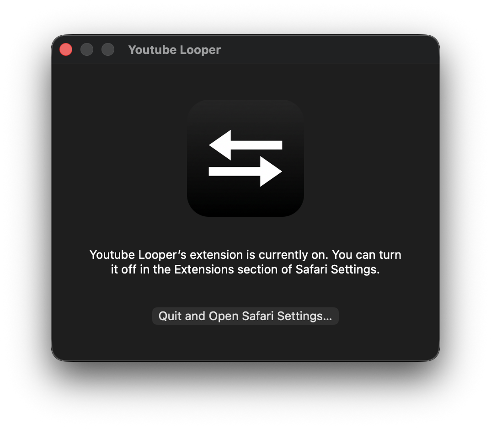

# YouTube Looper (릴리즈 전용)

[한국어](./README.md) | [English](./README.en.md) | [日本語](./README.ja.md)

이 저장소는 **릴리즈 배포 파일만** 관리합니다.
소스 코드는 별도 비공개 저장소에서 관리됩니다.

**[Mac App Store에서 Looper for Youtube 다운로드](https://apps.apple.com/kr/app/looper-for-youtube/id6805764066?mt=12)**

> **App Store 버전 안내:** App Store에 배포된 버전은 이 저장소의 공개 배포본보다 안정성과 사용성을 개선한 최신판입니다. 실제 사용은 App Store 버전을 권장합니다.

## 다운로드
- 최신 배포 파일: [Releases](https://github.com/adgk2349/Youtube_Looper/releases)

## 스크린샷

## 문서 언어
- [한국어(메인)](./README.md)
- [English](./README.en.md)
- [日本語](./README.ja.md)

## 참고
- 이 저장소에는 앱 소스 코드가 포함되어 있지 않습니다.

## 저작권
Copyright © 2026 Redbridge Company. All rights reserved.
